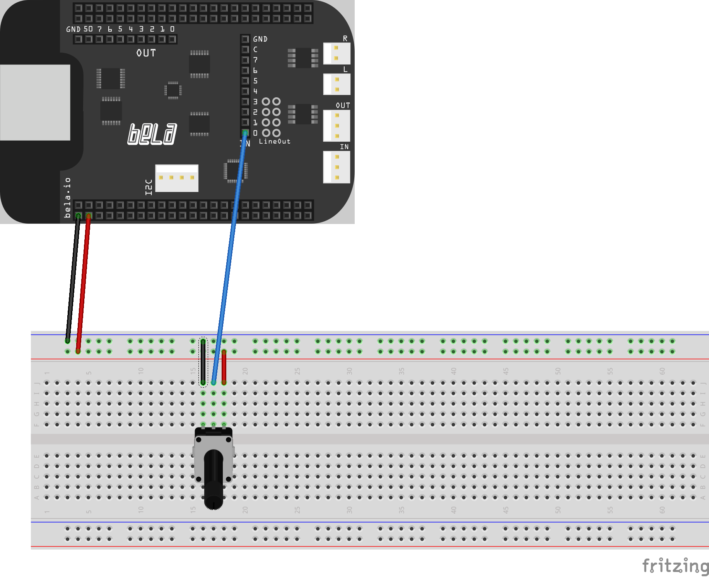

# Glicol on Bela

You can now design music interaction on [Bela board](https://bela.io) with Glicol syntax:

```
// the code works with the circuit shown below
o: sin 440 >> mul ~adc0
```

The potentiometer will control `~adc0` and thus control the amplitude of the sine osc.



I have also made a video demo for the new workflow: https://youtu.be/XKaSJh3B3go

## Acknowledgement

This crate is based on:

https://github.com/andrewcsmith/bela-rs

https://github.com/padenot/bela-sys

Thus, this version only works for OSX and Linux.
> I have only tested on M1 Mac.

## How to use this?

### Step 1: Get a Bela

Connect Bela to your computer and make sure you can visit `http://bela.local` in your browser.

### Step 2: Preparation for Rust

```sh
rustup target add armv7-unknown-linux-gnueabihf
rustup toolchain install stable-armv7-unknown-linux-gnueabihf
```
> For non-Rust programmers, you should have [Rust](https://www.rust-lang.org/) installed on your computer!

### Step 3: Clone this repo

`git clone` this whole repo, not just this folder.

I suggest you fork it first in case you want to contribute.

After you clone it, `cd` into the `rs/bela`.

### Step 4: Run the script

With a Bela board plugged in and its IDE accessible at `http://bela.local`, `cd` into `rs/bela`, and then run:

```sh
./setup.sh
```

> On Mac, you may need to run `sudo zsh setup.sh`

This downloads the right linker, pulls in some required files from the board,
and sets up the `$PATH` environment variable. This MUST be called in each
terminal session that will be used to call `cargo`, but will only download the
files once.

> You can change the `setup.sh` file mannualy when there is any missing files in this process. This may be due to potential future updates on the Bela dependancies.

### Step 5: Build the Glicol binary for Bela

```sh
./build.sh
```
> On Mac, you may need to run `sudo zsh build.sh`

This will build the `glicol.rs` from the example folder.

Then run `copy.sh`:
```sh
./copy.sh
```
Or `zsh copy.sh` on Mac.

This will:
- copy the binary file to Bela board
- `ssh` into the Bela board

> If you see that linker cannot be found in building, try to run the command in `linker.sh` manually in terminal. Then call the `build.sh` again.

If after this step, you successfully SSH on Bela root, run `ls` to see if `glicol` binary is there.

Call the command here to test if it works:

```sh
./glicol
```

### Step 6: Use Glicol

You have `~adc0` to `~adc7`. Just write code like this:

```
o: sin 440 >> mul ~adc0;
```

`~adc0` to `~adc7` are special reference that will be overwritten by Bela input.

To design interactions, just change `_main.glicol`, and then run `./run.sh`.

> On Mac, you may need to run `zsh run.sh`.

## TODO

- [x] Support ADC
- [ ] More params for `./glicol` command such as num_analog_in 
- [ ] Live coding?
- [ ] Optimise file size

This is experimental and a work in progress, but feel free to issue any problem you find.